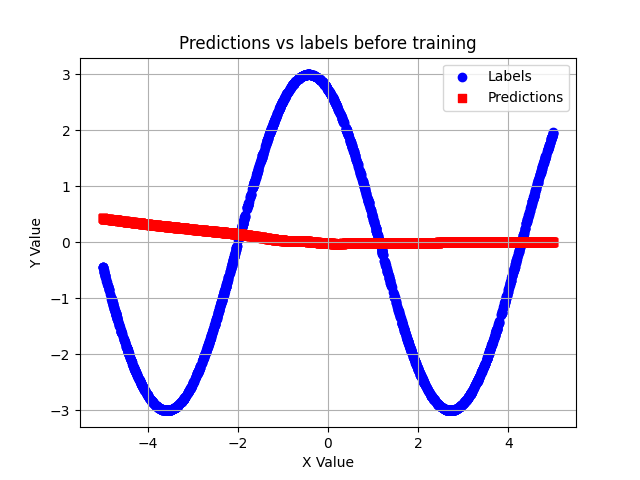

# sinusoid-fitting

Sinusoidal approximation with deep learning. Hyperparameters and architecture derived from [Model-Agnostic Meta-Learning for Fast Adaptation of Deep Networks](https://arxiv.org/pdf/1703.03400).

## Installation

Dependencies include:
* numpy
* matplotlib
* torch

To install all dependencies at once:

```
pip install -e .
```

To install each dependency individually:

```
pip install numpy
pip install torch
pip install matplotlib
```

## Running

To train the model and generate the figures in `/figs`:

```
python train_nn.py
```

## Performance


.png)
.png)
.png)
.png)
.png)


## License

This project is licensed under the [MIT license](https://mit-license.org/).
